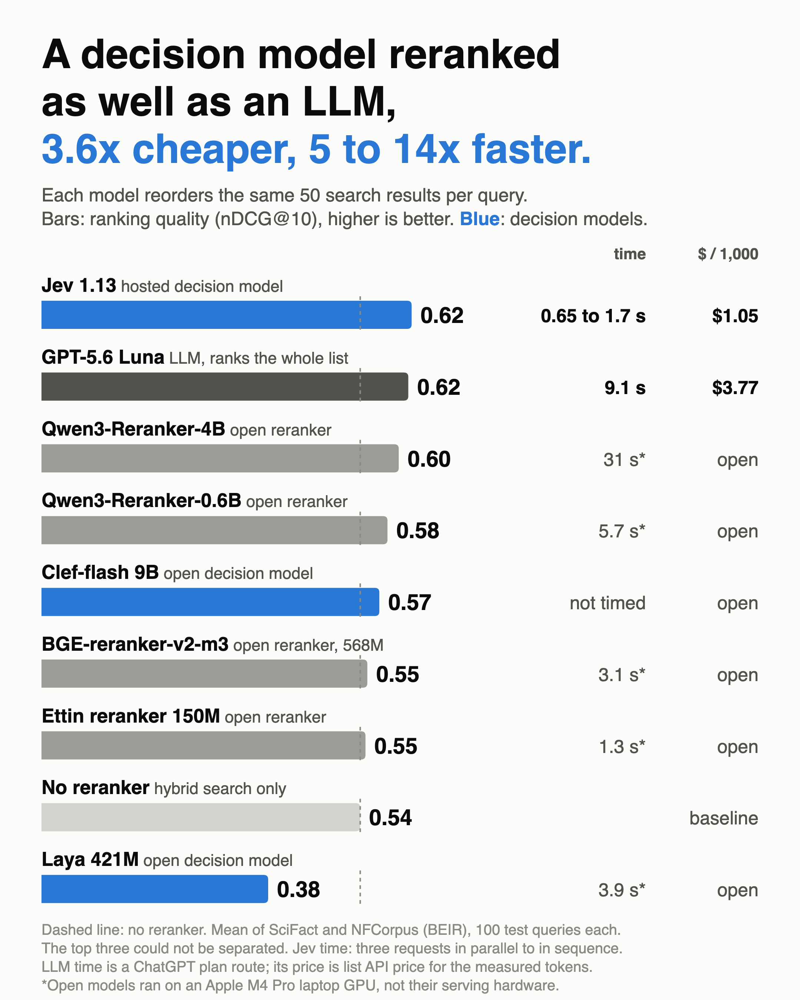
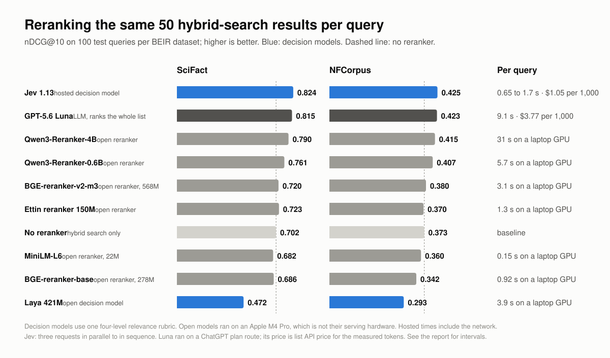

# Decision models as RAG rerankers

A benchmark of "System 1" decision models in the reranker slot of a retrieval pipeline, next to current open rerankers, an LLM that orders the whole list, and no reranker at all. A decision model does not generate text: it answers a typed question (yes or no, pick one, score on a rubric) about the input and returns probabilities, which makes it fast and cheap enough to call once per retrieved passage. Every model reorders the same 50 hybrid-search results per query on two [BEIR](https://github.com/beir-cellar/beir) datasets, SciFact and NFCorpus. The score is nDCG@10 against the published relevance judgments.

Measured 2026-10-05. This is a ranking benchmark; no answers were generated or graded.



## Findings

- **A hosted decision model matched the LLM.** Jev 1.13 scored 0.824 on SciFact and 0.425 on NFCorpus; GPT-5.6 Luna scored 0.815 and 0.423. The difference is within noise on both. Jev cost $1.05 per 1,000 queries against $3.77 at list price. It answered in 1.7 s with its three requests in sequence and 0.65 s with them in parallel, against 9.1 s for Luna on a ChatGPT plan route.
- **The largest open reranker tested was within noise of both.** Qwen3-Reranker-4B scored 0.790 and 0.415 with freely available weights. It took about 30 s per query on a laptop GPU, so its real cost is the GPU it is served on.
- **Smaller rerankers did not beat hybrid search.** Qwen3-Reranker-0.6B improved on no reranker on both datasets, narrowly on SciFact. BGE-reranker-v2-m3, Ettin 150M and MiniLM-L6 could not be told apart from no reranker, and BGE-reranker-base was worse on NFCorpus. The two older ones still rank above BM25 alone on most of the full-set comparisons; a hybrid first stage leaves them little to fix.
- **"Decision model" is not one quality level.** Laya, an open 421M decision model, ranked far below no reranker under all nine wordings tried. Clef-flash, an open 9.4B decision model given the same requests as Jev, scored 0.753 on SciFact with no failed queries: far above Laya, below Jev (-0.071, interval -0.116 to -0.031) and not clearly above no reranker (+0.051, interval -0.011 to +0.115). Its NFCorpus run was still in progress when this was written, so it is not yet in the tables or figures.

## Results

nDCG@10 on 100 test queries per dataset. Mean is the unweighted mean of the two datasets. Time is the median per query within a dataset, averaged over the two.

| Reranker | Kind | SciFact | NFCorpus | Mean | Time per query | Price per 1,000 queries |
| --- | --- | ---: | ---: | ---: | ---: | ---: |
| Jev 1.13 | hosted decision model | 0.824 | 0.425 | 0.625 | 1.7 s (0.65 s with parallel requests) | $1.05 billed |
| GPT-5.6 Luna | LLM, ranks the whole list | 0.815 | 0.423 | 0.619 | 9.1 s | $3.77 at list price |
| Qwen3-Reranker-4B | open reranker | 0.790 | 0.415 | 0.603 | 31 s * | open weights |
| Qwen3-Reranker-0.6B | open reranker | 0.761 | 0.407 | 0.584 | 5.7 s * | open weights |
| BGE-reranker-v2-m3 | open reranker, 568M | 0.720 | 0.380 | 0.550 | 3.1 s * | open weights |
| Ettin reranker 150M | open reranker | 0.723 | 0.370 | 0.547 | 1.3 s * | open weights |
| No reranker | hybrid search only | 0.702 | 0.373 | 0.538 |  |  |
| MiniLM-L6 | open reranker, 22M | 0.682 | 0.360 | 0.521 | 0.15 s * | open weights |
| BGE-reranker-base | open reranker, 278M | 0.686 | 0.342 | 0.514 | 0.92 s * | open weights |
| Laya 421M | open decision model | 0.472 | 0.293 | 0.382 | 3.9 s * | open weights |

\* Measured on an Apple M4 Pro laptop GPU. These models are normally served on CUDA, where they are faster, so read these times as a laptop figure and not as the models' serving speed.



### Paired differences

Difference in nDCG@10 on the same queries, with a 95% interval from a paired bootstrap over queries (10,000 resamples). Bold means the interval excludes zero. The intervals are not adjusted for the number of comparisons.

| Comparison | SciFact | NFCorpus |
| --- | --- | --- |
| Jev 1.13 minus no reranker | **+0.122 [+0.064, +0.181]** | **+0.052 [+0.021, +0.084]** |
| GPT-5.6 Luna minus no reranker | **+0.113 [+0.053, +0.175]** | **+0.050 [+0.016, +0.085]** |
| Qwen3-Reranker-4B minus no reranker | **+0.088 [+0.031, +0.147]** | **+0.042 [+0.015, +0.069]** |
| Qwen3-Reranker-0.6B minus no reranker | **+0.059 [+0.003, +0.116]** | **+0.033 [+0.010, +0.057]** |
| BGE-reranker-v2-m3 minus no reranker | +0.017 [-0.022, +0.056] | +0.007 [-0.022, +0.034] |
| Ettin reranker 150M minus no reranker | +0.021 [-0.033, +0.075] | -0.003 [-0.036, +0.029] |
| MiniLM-L6 minus no reranker | -0.021 [-0.072, +0.028] | -0.013 [-0.039, +0.012] |
| BGE-reranker-base minus no reranker | -0.017 [-0.066, +0.032] | **-0.031 [-0.060, -0.003]** |
| Laya 421M minus no reranker | **-0.230 [-0.307, -0.155]** | **-0.081 [-0.123, -0.043]** |
| Jev 1.13 minus GPT-5.6 Luna | +0.009 [-0.023, +0.045] | +0.002 [-0.021, +0.027] |
| Jev 1.13 minus Qwen3-Reranker-4B | +0.034 [-0.009, +0.079] | +0.010 [-0.013, +0.034] |
| GPT-5.6 Luna minus Qwen3-Reranker-4B | +0.024 [-0.018, +0.069] | +0.008 [-0.016, +0.031] |
| Jev 1.13 minus Qwen3-Reranker-0.6B | **+0.063 [+0.023, +0.107]** | +0.019 [-0.005, +0.042] |
| Qwen3-Reranker-4B minus Qwen3-Reranker-0.6B | +0.029 [-0.003, +0.064] | +0.009 [-0.008, +0.026] |

With 100 queries per dataset, differences under about 0.03 on NFCorpus and under 0.04 to 0.06 on SciFact cannot be told from noise. Jev, Luna and Qwen3-Reranker-4B could not be separated from each other, and neither could the two Qwen3 rerankers.

## What ran

| Model | Kind | Release used | How it ranks the 50 candidates |
| --- | --- | --- | --- |
| [Jev 1.13](https://docs.typesafe.ai/models) | Hosted decision model | `typesafe/jev-1.13` through OpenRouter | Three requests of 17, 17 and 16 passages, one rubric question per passage |
| [Clef-flash](https://huggingface.co/Cloudflare/clef-flash) | Open decision model, 9.4B | revision `17f0b0ad` | The same three request bodies as Jev, answered locally by the release's own code |
| [Laya](https://huggingface.co/convaiinnovations/laya) | Open decision model, 421M | revision `55cf4c4e` | One passage per request; its input is limited to 512 tokens including the question |
| GPT-5.6 Luna | LLM, low reasoning effort | `gpt-5.6-luna` | One request that returns an ordering of all 50 passages |
| [Qwen3-Reranker-4B](https://huggingface.co/Qwen/Qwen3-Reranker-4B) | Open reranker | revision `22e68366` | One query-passage pair per row, the model's default prompt |
| [Qwen3-Reranker-0.6B](https://huggingface.co/Qwen/Qwen3-Reranker-0.6B) | Open reranker | revision `e61197ed` | Same |
| [BGE-reranker-v2-m3](https://huggingface.co/BAAI/bge-reranker-v2-m3) | Open reranker, 568M | revision `953dc6f6` | Same |
| [Ettin reranker 150M](https://huggingface.co/cross-encoder/ettin-reranker-150m-v1) | Open reranker | revision `025501c4` | Same |
| [BGE-reranker-base](https://huggingface.co/BAAI/bge-reranker-base) | Open reranker, 278M | revision `2cfc18c9` | Same, 512-token input |
| [MiniLM-L6](https://huggingface.co/cross-encoder/ms-marco-MiniLM-L6-v2) | Open reranker, 22.7M | revision `233902d2` | Same, 512-token input |
| No reranker | Baseline | | Keeps the hybrid-search order |

Full revisions, prompts and query IDs are in the [result file](results/reranker-benchmark.json).

## Method

**Candidates.** SQLite FTS5 BM25 and exact cosine search over [BGE-small-en-v1.5](https://huggingface.co/BAAI/bge-small-en-v1.5) embeddings each return 50 documents. Reciprocal rank fusion (constant 60) merges them and the top 50 go to every reranker. Documents are the BEIR title and text joined; nothing is chunked.

**Queries.** The retrieval baselines and the two 512-token rerankers ran on every test query. The other models ran on a comparison set of 100 test queries per dataset, drawn at random with a recorded seed before any of them ran. A separate tuning set of 50 queries per dataset, disjoint from the comparison set, was used only for the Laya wording sweep below.

**Decision-model question.** Decision models answer a typed question about a state and return probabilities. All three get the same question for each passage:

> How well does the passage supply the information needed to answer or verify the query?
>
> 0. The passage is off-topic for the query.
> 1. The passage is on a related topic but does not supply what the query asks for.
> 2. The passage partly supplies the information needed to answer or verify the query.
> 3. The passage fully supplies the information needed to answer or verify the query.

Passages are ordered by the expected level. The rubric and the batched request shape come from [jev-rerank-bench](https://github.com/anessbelbati/jev-rerank-bench), a public study of Jev reranking prompts over eight BEIR datasets, SciFact and NFCorpus among them. There a four-level rubric with several passages per request scored best (0.692 mean nDCG@10) and yes/no with one passage per request scored 0.670. That study sends up to 30 passages per request; this benchmark sends 17 so that the same request also fits Clef-flash's default input limit. Laya cannot take several passages per request, so it gets the same rubric one passage at a time.

**Each model in its normal mode.** The LLM sees all 50 passages at once. Jev and Clef-flash see 17 at a time. Laya and the open rerankers score one passage at a time. This compares the models as they are deployed, not under one identical protocol.

**Registration.** Each run has a registration file written before it started: model and revision, exact wording, query IDs, candidate-file hash, failure rule and, for paid runs, a spending ceiling. A failed query stays in the comparison with an empty ranking. All registrations are in the result file.

**Order of the runs.** The plan changed twice after results were seen, and both changes are recorded in the registrations. Laya and Luna ran first, with Laya on a yes/no question. Laya's low score prompted the rubric and the wording sweep described below, and the batched four-level rubric then replaced a yes/no question that had been registered for Jev and Clef-flash but never run. The four newer open rerankers were added after the first comparison showed MiniLM-L6 and BGE-reranker-base level with hybrid search; they were chosen from public leaderboards before any of them ran. Each model's plumbing was first checked on two or three comparison queries.

**Metric.** nDCG@10 with linear graded gain, the `ndcg_cut_10` definition of `trec_eval`, over every judged-relevant document. The [tests](tests/test_screen.py) check it against hand-computed values.

## Baselines against published numbers

The first stage and the two 512-token rerankers on the full test sets:

| Arm | SciFact (300 queries) | NFCorpus (323 queries) |
| --- | ---: | ---: |
| BM25 | 0.664 | 0.306 |
| Dense, BGE-small-en-v1.5 | 0.713 | 0.344 |
| Hybrid (the candidates every reranker gets) | 0.713 | 0.353 |
| MiniLM-L6 over the hybrid top 50 | 0.697 | 0.356 |
| BGE-reranker-base over the hybrid top 50 | 0.721 | 0.325 |

BM25 on SciFact and the dense numbers on both datasets agree with the figures commonly reported for BEIR. BM25 on NFCorpus is about 0.02 lower than usual because this index does not stem. Hybrid search is not measurably better than dense search alone on either dataset (+0.000 and +0.009).

| Comparison | SciFact | NFCorpus |
| --- | --- | --- |
| no reranker minus BM25 | **+0.049 [+0.025, +0.073]** | **+0.047 [+0.033, +0.061]** |
| MiniLM-L6 minus BM25 | +0.033 [-0.000, +0.068] | **+0.050 [+0.034, +0.067]** |
| BGE-reranker-base minus BM25 | **+0.057 [+0.029, +0.087]** | **+0.018 [+0.002, +0.035]** |
| MiniLM-L6 minus no reranker | -0.016 [-0.044, +0.014] | +0.003 [-0.011, +0.018] |
| BGE-reranker-base minus no reranker | +0.008 [-0.019, +0.037] | **-0.028 [-0.045, -0.012]** |

On the full test sets BGE-reranker-base ranks above BM25 alone on both datasets and MiniLM-L6 on NFCorpus, which is the comparison their published gains come from. Over hybrid search neither adds anything measurable, and BGE-reranker-base is worse on NFCorpus.

## Laya wording sweep

Laya first ran on the comparison set with a yes/no question (0.428 on SciFact, 0.282 on NFCorpus) and then with the four-level rubric (0.472, 0.293). Both were far below hybrid search, so nine wordings were then swept on the separate tuning queries to check that wording was not the cause. The rule, fixed before the sweep, was to take the wording with the highest nDCG@10 averaged over both tuning sets.

| Wording | SciFact | NFCorpus | Average | Inputs cut at 512 tokens |
| --- | ---: | ---: | ---: | ---: |
| Rubric, 3 levels | 0.541 | 0.302 | 0.421 | 19 to 20% |
| Rubric, 5 levels | 0.523 | 0.318 | 0.420 | 29 to 30% |
| Rubric, 4 levels (the one above) | 0.512 | 0.326 | 0.419 | 24 to 25% |
| Yes/no as a choice | 0.513 | 0.315 | 0.414 | 12 to 14% |
| 5-level search-style rubric | 0.521 | 0.299 | 0.410 | 18 to 19% |
| Short 4-level rubric | 0.509 | 0.289 | 0.399 | 13 to 15% |
| Yes/no as true/false | 0.502 | 0.295 | 0.398 | 11 to 13% |
| Yes/no, "helps answer" | 0.494 | 0.292 | 0.393 | 12 to 14% |
| Rubric, 2 levels | 0.461 | 0.299 | 0.380 | 16 to 17% |
| No reranker, same queries | 0.752 | 0.337 | 0.545 | |

The best wordings are a statistical tie: three levels minus four levels is +0.003 (interval -0.026 to +0.032), and only the two-level rubric is clearly worse than the best. Because four levels ties Laya's best and is the published best for Jev, every decision model uses four levels in the main table. Laya's nominal winner, three levels, scored 0.466 on SciFact and 0.286 on NFCorpus on the comparison set, slightly below its four-level result. No wording brought Laya near hybrid search.

## Cost and time

- **Jev.** 5.0M input tokens over the 200 comparison queries, $0.211 billed by OpenRouter, about 25,000 tokens per query. Most of that is the rubric repeated for each passage. In the scored run the three requests of a query were sent one after another and the median was 1.7 s. A registered timing check on 40 of the same queries sent the three requests at the same time and measured a median of 0.65 s. Against Luna's 9.1 s that is 5 to 14 times faster. The check's nDCG@10 differed from the scored run's by about 0.002, with small changes in individual scores, so Jev is close to but not exactly deterministic.
- **GPT-5.6 Luna.** About 17,000 input tokens per query. The run used a ChatGPT plan route to the Responses API, so the price is the list API price applied to the measured tokens ($0.20 per million input, $1.20 per million output, read 2026-10-05) and the time is that route's, not the paid API's.
- **Open models.** All ran on an Apple M4 Pro with 48 GB. Laya's faster path is CUDA-only. Clef-flash ran on reference kernels at roughly 105 s per query, which says nothing about its speed on CUDA, so no time is reported for it.
- **Hosted prices for open rerankers** were not measured here. A [public benchmark](https://github.com/denser-org/rerank-bench-jev) reports Qwen3-Reranker-0.6B on a hosted endpoint at about a quarter of Jev's price per query.

## Failures and repairs

- **Luna.** The first pass sent both datasets in parallel and 50 of 200 queries failed or were not sent; a hand-sent repeat returned `server_is_overloaded`. Only the failed queries were retried, twice, each retry registered with its reason. One query per dataset still failed and counts as an empty ranking for Luna. On the 99 queries per dataset that Luna answered it scores 0.823 and 0.427 against Jev's 0.822 and 0.422, so the order of the two in the table comes from those two failures.
- **Luna's orderings** needed small repairs over 198 answers: 3 unknown IDs dropped, 136 repeated IDs dropped and 23 omitted passages appended in retrieval order.
- **Jev.** 200 of 200 queries completed, and 40 of 40 in the timing check.
- **Laya.** 24% of its inputs were cut at 512 tokens with the four-level rubric and 13% with yes/no.
- **Open rerankers.** No failures. At most 3 of 5,000 passages per run were longer than 2,048 tokens on their own and were cut.
- **Clef-flash.** 100 of 100 SciFact queries completed; NFCorpus was still running when this was written.
- **Registration text that was superseded.** Registrations are published as written. Four of their fields are out of date and the text above is the correct account: the limit "one wording per arm, written before any arm ran; no prompt search" predates the Laya sweep; the Jev registration mentions eight parallel requests, but the scored run sent its three requests in sequence; the `primary` fields name MiniLM-L6 as the comparison, while this report compares against no reranker; and the Luna registration's `method` text also describes the unrun yes/no arms.

## Related public benchmarks

- [anessbelbati/jev-rerank-bench](https://github.com/anessbelbati/jev-rerank-bench) compares Jev prompt shapes across eight BEIR datasets. Its best setting, a four-level rubric with batched passages, is the one used here.
- [denser-org/rerank-bench-jev](https://github.com/denser-org/rerank-bench-jev) compares Jev with a hosted Qwen3-Reranker-0.6B over BM25 top 100 on the same two datasets. It reports Jev ahead on SciFact (0.770 against 0.748), level on NFCorpus, and a p50 of 0.64 s for Jev. The Qwen3-0.6B score here (0.761 on SciFact), the pattern against Jev and the Jev latency are consistent with it. Jev's score here is higher (0.824), with a different first stage and 100 queries.
- [vvr-rao/jev-benchmarks](https://github.com/vvr-rao/jev-benchmarks) reports Jev, Cohere Rerank 4 Pro and Qwen3-Reranker-8B within 0.007 of each other on SciFact. Cohere was not run here.
- [nadeem4/ai-experiments](https://github.com/nadeem4/ai-experiments/blob/main/rerank/RESULTS.md) found Laya below hybrid search and Jev above it on NFCorpus, which this benchmark confirms.

What this benchmark adds: an LLM listwise reranker and locally run open rerankers on the same candidates, two open decision models, the Laya wording sweep, a hybrid first stage, and paired intervals for every comparison.

## Limits

- 100 queries per dataset. Differences under about 0.03 on NFCorpus and 0.04 to 0.06 on SciFact are within noise, and the intervals are not adjusted for the number of comparisons.
- Two datasets, both scientific or medical English text. Other domains may order the models differently.
- Candidates are the top 50 of one hybrid retriever. A reranker cannot recover a document retrieval missed, and a weaker first stage leaves more for a reranker to fix.
- The models were not run under one protocol: the LLM sees 50 passages at once, Jev and Clef-flash 17, the others one.
- Prompt effort was not equal. Jev's rubric is the best of several from a public study that included these two datasets. Luna got one generic ranking prompt and the Qwen3 rerankers their packaged default instruction; neither was tuned.
- Times mix a hosted API, a plan route and a laptop GPU. Only Jev against Luna compares two hosted services, and Luna's route is not the paid API. Jev's faster figure comes from 40 queries.
- MiniLM-L6 and BGE-reranker-base read 512 tokens; 9% of documents are longer. The newer rerankers read up to 2,048.
- Both datasets are public and may be in any model's training data.
- The Luna route has no temperature control and was unreliable under load.
- Jev's price and behaviour belong to version 1.13 on the day of the run.
- One Laya checkpoint and one Clef checkpoint were tested, with released weights and no training.
- Cohere Rerank and other hosted rerankers were not run.

## Reproduce

[`results/reranker-benchmark.json`](results/reranker-benchmark.json) holds the summaries, every registration with its query IDs and wording, the wording sweep and token usage. Registrations are published with local paths shortened. Raw per-request outputs are not in the repository.

Download SciFact and NFCorpus from the [BEIR distribution](https://github.com/beir-cellar/beir) and unpack them so that each folder has `corpus.jsonl`, `queries.jsonl` and `qrels/test.tsv`.

```sh
poetry install --with models,hosted

# Retrieval, MiniLM-L6 and BGE-reranker-base on every test query
poetry run python -m rerank_bench.screen run \
  --dataset data/scifact \
  --embedding-cache models/embeddings --reranker-cache models/rerankers \
  --device mps --output-dir runs/scifact

# One registered model on the saved candidates
poetry run python -m rerank_bench.arms \
  --registration examples/scifact-qwen3-4b.json --output-dir runs/scifact/arms/qwen3-4b/run

# Score any set of ranking files on the queries they share
poetry run python -m rerank_bench.screen report \
  --dataset data/scifact \
  --rankings runs/scifact/rankings.jsonl runs/scifact/arms/qwen3-4b/run/rankings.jsonl \
  --compare hybrid:qwen3-4b --output runs/scifact/summary.json

# Redraw the figures from the result file
poetry run python -m rerank_bench.figure
```

- Use `--device cuda` on an NVIDIA GPU, and set `"device": "cuda"` in a registration. Models load from the cache folders without network access, so download them there once first, for example `hf download Qwen/Qwen3-Reranker-4B --cache-dir models/rerankers`.
- A registration names the model and revision, wording, query IDs, candidate file and its hash. [`examples/`](examples) has one per kind of model; the result file has all of them. A run refuses to start if the candidate file does not match the registered hash. Candidates built on other hardware can differ in tie order, so set `candidates_sha256` to the hash of your own file, which `screen run` writes to `manifest.json`.
- `figure` writes the two SVG files. The PNG copies were rendered from them at twice the size with a headless browser.
- The Jev run reads `OPENROUTER_API_KEY` and the LLM run reads `OPENAI_API_KEY`, from the environment or an ignored `.env` file. The Jev run stops at the registered spending ceiling. The published LLM numbers came through a ChatGPT plan route; this code uses the standard API.
- The Laya run needs a local copy of the pinned checkpoint. The Clef-flash run needs the release folder, which contains its own decision-head code.

## Repository layout

```text
rerank_bench/
  retrieval.py   pinned first-stage models, query parsing, rank fusion
  screen.py      candidates, 512-token rerankers, metrics, paired bootstrap, report
  arms.py        decision-model, cross-encoder and LLM runners over saved candidates
  figure.py      figures from the result file
tests/           metric arithmetic, request construction, ranking repairs, failure accounting
examples/        one registration per kind of model
results/         result file and figures
```

## Checks

```sh
poetry install
poetry run python -m unittest discover -s tests -v
poetry run ruff check . && poetry run ruff format --check .
```

The tests check the metric against hand-computed values, the ranking repairs, request construction and failure accounting. They load no model and make no network request.

## License

[MIT](LICENSE). The datasets and models keep their own licenses.
